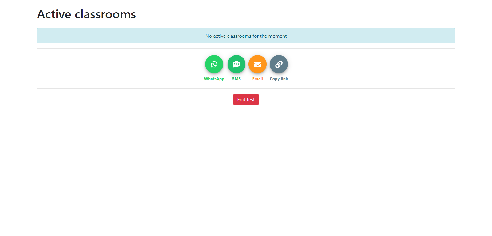

# [Oral bagrut](https://oral-bagrut.web.app/)

A website made to ease student distribution to the teachers during oral tests.

### Introduction

In a normal situation, students start their tests in a classroom and let the room supervisor know when they are ready to pass their tests. The examiners have to return to the preparation room each time they finish with a student to take a newly available one.

Oral-bagrut is a website that makes it possible to manage the queue of students in an efficient way, to fluidify the system, and make it faster.

## How does it work?

### For the administrator

The administrator can create a session and share a link to join it quickly for the supervisors and the teachers.

He creates the session by clicking on the Create test button and enters a 6-digit PIN and a password (6 character minimum). 

> *Note: to create a session, the user has to be registered.*

He then accesses the dashboard, where he can have information about the classrooms and the students. 

He can delete the session after the test.

If he disconnects from the webpage, he can access it with the create test button and by entering the PIN and the password again.



### For the Supervisor

The Supervisor is someone watching over the preparation room during the examination. When Supervisors arrive there, they have to enter the session the admin created using the PIN and the password, or with the link provided. Then they have to give information about the room they are in and their name. 

During the test, when a student is available for oral testing, the Supervisor enters their name in the webpage. He will get a notification when he has to send a student with the name of the Examinator and his room.

### For the Examinator

The Examinator is the teacher testing the student. Like the Supervisors, they enter their name and the room they are testing. When they are ready to test a student, they click on the "Next Student" button. 

If a student is available, the Supervisor sends him immediately to your room. However, if no student is available, a Supervisor will send one when one is ready.

---

If you want to base you own website on this one, you can:

- Clone the project
- ```npm install```
- Create a firebase project
- Use your token in ```/src/environments/environment.ts```

This project was generated with [Angular CLI](https://github.com/angular/angular-cli) version 9.1.7.


